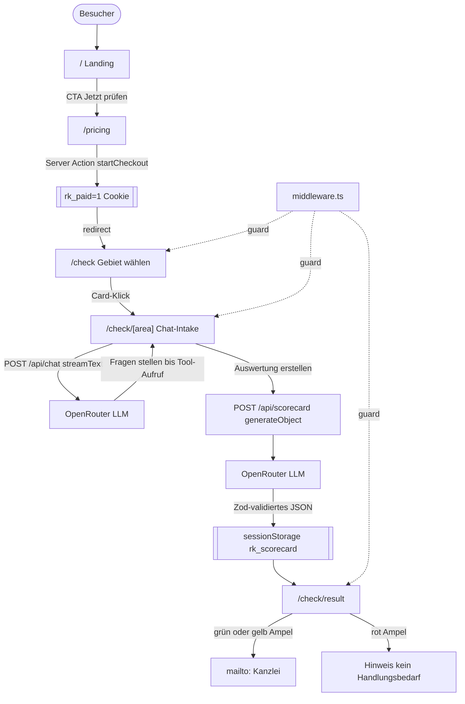

# Recht-Klar MVP – Detailplan

## 1. Produktvision & Tonalität

**Problem**: Rechtswissen ist teuer und schwer zugänglich. Viele Menschen wissen nicht, ob ein Anwaltsgang lohnt.

**Lösung**: Ein geführter „Legal-Check" für 40 € pauschal, der in ~5 Minuten eine visuelle Ersteinschätzung (Handlungsbedarf, Erfolgschance, Kostenrisiko) liefert und bei grünem Licht direkt an eine Partnerkanzlei übergibt.

**Tonalität**: Seriös, ruhig, vertrauenerweckend – kein „Tech-Hype". Sprache einfach, ohne Juristen-Jargon. Duzen (konsistent). Kurze Sätze. Dark Mode als Default signalisiert Premium-Produkt.

**Positionierung**: „Information, nicht Beratung" – klar und wiederholt sichtbar. Keine Heilsversprechen.

## 2. Design System

### 2.1 Farbtokens (OKLCH, in `app/globals.css` unter `@theme inline`)

Dark-Mode ist Default. Helles Theme optional später.

```css
@theme inline {
  /* Base – shadcn zinc-ähnlich, leicht wärmer */
  --color-background: oklch(0.145 0.005 260);
  --color-foreground: oklch(0.985 0 0);

  --color-card: oklch(0.19 0.006 260);
  --color-card-foreground: oklch(0.985 0 0);

  --color-popover: oklch(0.19 0.006 260);
  --color-popover-foreground: oklch(0.985 0 0);

  --color-muted: oklch(0.26 0.005 260);
  --color-muted-foreground: oklch(0.72 0.01 260);

  --color-border: oklch(0.28 0.008 260);
  --color-input: oklch(0.28 0.008 260);

  /* Brand – tiefes Justitia-Blau mit Grünstich (Vertrauen + Legal) */
  --color-primary: oklch(0.68 0.14 230);
  --color-primary-foreground: oklch(0.145 0.005 260);

  --color-secondary: oklch(0.26 0.005 260);
  --color-secondary-foreground: oklch(0.985 0 0);

  --color-accent: oklch(0.32 0.02 230);
  --color-accent-foreground: oklch(0.985 0 0);

  --color-ring: oklch(0.68 0.14 230);

  /* Ampel – für Scorecard */
  --color-success: oklch(0.74 0.17 152);        /* Grün – Handlungsbedarf Ja / hohe Chance */
  --color-success-foreground: oklch(0.145 0 0);
  --color-warning: oklch(0.82 0.16 85);         /* Bernstein – Beobachten / mittlere Chance */
  --color-warning-foreground: oklch(0.145 0 0);
  --color-destructive: oklch(0.65 0.22 27);     /* Rot – geringe Chance / kein Handlungsbedarf */
  --color-destructive-foreground: oklch(0.985 0 0);

  /* Radius – shadcn Default */
  --radius: 0.625rem;
  --radius-sm: calc(var(--radius) * 0.75);
  --radius-md: calc(var(--radius) * 0.875);
  --radius-lg: var(--radius);
  --radius-xl: calc(var(--radius) * 1.5);

  /* Fonts – LITERAL, nicht var() (Tailwind v4 @theme inline bug) */
  --font-sans: "Geist", "Geist Fallback", ui-sans-serif, system-ui, sans-serif;
  --font-mono: "Geist Mono", "Geist Mono Fallback", ui-monospace, monospace;
}
```

### 2.2 Typografie

- **Familie**: Geist Sans (UI), Geist Mono (Zahlen in Scorecard, § Zitate)
- **Skala**:
  - Display: `text-5xl md:text-6xl font-semibold tracking-tight` (Landing-Hero)
  - H1: `text-3xl md:text-4xl font-semibold tracking-tight`
  - H2: `text-2xl font-semibold`
  - H3: `text-lg font-medium`
  - Body: `text-base leading-7`
  - Small/Meta: `text-sm text-muted-foreground`

### 2.3 Spacing & Layout

- **Container**: `max-w-6xl mx-auto px-6 md:px-8` (Default); `max-w-3xl` für Lesetext, `max-w-2xl` für Chat
- **Sektion-Rhythmus**: `py-16 md:py-24` zwischen Landing-Sektionen
- **Card-Padding**: `p-6` Standard, `p-8` für Hero-Cards
- **Gap**: `gap-6` comfortable, `gap-4` compact

### 2.4 Komponentenbibliothek (shadcn, new-york, base radix)

Zu installieren: `button card badge input label textarea progress separator sonner alert alert-dialog tabs accordion avatar scroll-area tooltip sheet skeleton dialog`

AI Elements: `conversation message prompt-input response suggestion reasoning`

### 2.5 Motion

- Hover-States: `transition-colors duration-200`
- Stream-Messages im Chat: Fade-in via AI Elements Defaults
- Scorecard-Reveal: stagger 50ms pro Karte (einfache CSS transition)
- **Keine** Gradients auf Foundation-Surfaces, **kein** Glassmorphism

### 2.6 Icons

`lucide-react`: `Scale` (Brand), `Home` (Miete), `Briefcase` (Arbeit), `ShoppingBag` (Kauf), `Car` (Verkehr), `ShieldCheck` (Versicherung), `CheckCircle2`, `AlertTriangle`, `XCircle`, `ArrowRight`, `Sparkles`

## 3. Architektur & Datenfluss



**Datenhaltung**: Keine Datenbank. Chat-Messages leben im React-State via `useChat`. Scorecard-Ergebnis landet in `sessionStorage['rk_scorecard']` und wird auf `/check/result` gelesen. Bei Tab-Schließen: weg – gewollt im MVP.

## 4. Kompletter User-Flow (Schritt für Schritt)

### Schritt 1 – Landing `/`

**Ziel**: Vertrauen aufbauen, Value klar machen, zum Pricing führen.

Sektionen von oben nach unten:

1. **SiteHeader**: Logo „Recht-Klar" (Scale-Icon + Wortmarke), Nav-Links [Wie es funktioniert, Preis, FAQ], rechts Button „Jetzt prüfen" (`variant="default"`)
2. **Hero** (`py-24 md:py-32`):
   - Eyebrow-Badge: „KI-gestützte Ersteinschätzung · 40 €"
   - H1: „Rechtssicherheit in 5 Minuten. Zum Festpreis."
   - Sub: „Beschreibe dein rechtliches Anliegen im geführten Chat. Erhalte eine klare Einschätzung: Handlungsbedarf, Erfolgschance, Kostenrisiko."
   - Primary-CTA: „Legal-Check starten – 40 €" → `/pricing`
   - Secondary-Link: „So funktioniert's ↓"
   - Kleine Zeile: „Keine Rechtsberatung. Reine Information gemäß § 2 RDG."
3. **Problem-Sektion** (3 Cards `grid md:grid-cols-3`):
   - „Anwalt-Erstberatung kostet 190–500 €" (Icon `Euro`)
   - „Rechtsschutz greift oft nicht ohne Klage" (Icon `ShieldOff`)
   - „Google-Recherche ist riskant & unspezifisch" (Icon `Search`)
4. **How-it-works** (3 Steps horizontal):
   - 1. Rechtsgebiet wählen
   - 2. Fragen des Assistenten beantworten (~5 Min)
   - 3. Scorecard + nächste Schritte erhalten
5. **Beispiel-Case** (Card mit Eigenbedarfs-Beispiel aus Brief, zeigt Scorecard-Mockup mit 75 % Erfolgschance)
6. **Pricing-Teaser** (verkleinerte Version der Pricing-Card, CTA → `/pricing`)
7. **FAQ** (`Accordion`, 6 Fragen):
   - Ist das Rechtsberatung?
   - Was sind meine Daten wert / wo werden sie gespeichert?
   - Was passiert nach dem Check?
   - Kann ich Geld zurückbekommen?
   - Welche Rechtsgebiete werden abgedeckt?
   - Wer steht hinter Recht-Klar?
8. **Final-CTA** (full-width Banner mit Button)
9. **SiteFooter** (Impressum, Datenschutz, Disclaimer-Link, © 2026 Recht-Klar)

### Schritt 2 – Pricing `/pricing`

**Ziel**: Zahlungs-Intent erzeugen (mock), Cookie setzen.

Layout: `max-w-xl mx-auto py-16`

- H1: „Ein Preis. Eine klare Antwort."
- Einzige Card (`p-8`):
  - Badge: „Legal-Check"
  - Preis: `text-5xl font-semibold` „40 €" + `text-sm text-muted-foreground` „einmalig · inkl. MwSt."
  - Feature-Liste mit `CheckCircle2`:
    - „Geführter Chat-Intake"
    - „Visuelle Legal Scorecard"
    - „Erfolgschance & Kostenrisiko"
    - „Direkte Übergabe an Partnerkanzlei"
    - „Keine Abo-Falle"
  - Primary-Button `w-full size="lg"`: „Jetzt für 40 € starten" → Server Action `startCheckout()`
- Darunter `Alert` (variant info): Disclaimer-Text
- Kleiner Hinweis: „Zahlung im MVP gemockt – keine echte Abbuchung." (nur solange `NEXT_PUBLIC_MOCK_PAYMENT=1`)

### Schritt 3 – Rechtsgebiet-Wahl `/check`

**Ziel**: Nutzer auf ein Rechtsgebiet committen → passender System-Prompt.

Layout: `max-w-5xl py-12`

- H1: „Worum geht es?"
- Sub: „Wähle den Bereich, der am besten passt."
- `grid md:grid-cols-3 gap-4`: 5 große Cards, jede mit Icon + Titel + 1-Satz-Beispielen + Hover-Border primary
- Unterste Reihe zentriert (falls 5 Items, 3+2): letzte Karte mit „Nichts passt? → E-Mail an uns" (disabled für MVP oder mailto)

### Schritt 4 – Chat-Intake `/check/[area]`

**Ziel**: Strukturierte Fakten vom Nutzer einholen.

Layout: `max-w-2xl py-8 flex flex-col h-[calc(100vh-var(--header-h))]`

- **Header-Zeile**: Back-Link `← Anderes Gebiet`, Area-Titel, Progress-Bar (`Progress value={Math.min(userTurns/6,1)*100}`)
- **Sticky Alert** oben im Chat-Container: kompakter Disclaimer
- **Conversation** (AI Elements, `flex-1 overflow-auto`):
  - Erste Assistant-Nachricht fix aus Area-Config: „Hallo! Ich helfe dir bei [Area]. Erzähl mir zuerst in deinen Worten, was passiert ist."
  - Weiter im Chat über `useChat` gegen `/api/chat`
- **PromptInput** unten (AI Elements): Textarea + Send-Button, disabled während Stream
- **Abschluss-Button** über PromptInput, erscheint ab ≥4 User-Turns ODER wenn LLM `generateScorecard`-Tool callt: „Auswertung jetzt erstellen →"
  - Klick → POST `/api/scorecard` mit `{area, messages}` → Loading-Overlay („Auswertung läuft…") → sessionStorage set → `router.push('/check/result')`

### Schritt 5 – Scorecard `/check/result`

**Ziel**: Visuelle Ersteinschätzung + Conversion zur Kanzlei.

Layout: `max-w-4xl py-12`

- H1: „Deine Legal Scorecard"
- Sub mit Area-Label + Zeitstempel
- **3-Card-Grid** (`grid md:grid-cols-3 gap-4`):
  1. **Handlungsbedarf** – großes Ampel-Symbol (`CheckCircle2`/`AlertTriangle`/`XCircle`), Enum-Label, 1-Satz-Begründung
  2. **Erfolgschance** – Circular Progress (SVG) mit Prozentzahl (`font-mono text-5xl`), Begründung drunter
  3. **Kostenrisiko** – Streitwert vs. Geschätzte Kosten als Balken, RVG-Hinweis, Rechtsschutz-Tipp
- **Rechtlicher Check** (Card full-width): Absatz mit rechtlicher Einordnung
- **Empfehlung** (Card): Konkreter nächster Schritt, hervorgehoben
- **CTA-Block**:
  - Bei `ampel === "gruen"` oder `"gelb"`: Primary-Button `size="lg"` „An Partnerkanzlei übergeben →" → `mailto:kanzlei@recht-klar.de?subject=...&body=...`
  - Bei `ampel === "rot"`: Info-Alert „Ein Anwaltsgang ist laut Einschätzung nicht zu empfehlen. Du kannst trotzdem eine zweite Meinung einholen."
  - Secondary-Button: „Neuen Check starten" → `/check`
- **Disclaimer** full-width unten

**mailto-Body** (URL-encoded):
```
Hallo,
ich habe über Recht-Klar eine Ersteinschätzung erhalten und möchte einen Beratungstermin.

Rechtsgebiet: {area}
Handlungsbedarf: {handlungsbedarf}
Erfolgschance: {erfolgschance.prozent} %
Streitwert (geschätzt): {kostenrisiko.streitwertEuro} €
Kosten (geschätzt): {kostenrisiko.geschaetzteKostenEuro} €

Rechtliche Einordnung der KI:
{rechtlicherCheck}

Empfehlung der KI:
{empfehlung}

Bitte um Rückmeldung für einen Termin.
```

## 5. Dateistruktur

```
app/
  layout.tsx                   # RootLayout (de, fonts, providers)
  globals.css                  # Theme-Tokens
  page.tsx                     # Landing
  pricing/
    page.tsx
    actions.ts                 # Server Action startCheckout()
  check/
    page.tsx                   # Area-Auswahl
    [area]/
      page.tsx                 # Chat-Intake
    result/
      page.tsx                 # Scorecard
  api/
    chat/route.ts              # streamText
    scorecard/route.ts         # generateObject
  not-found.tsx
  error.tsx
middleware.ts                  # rk_paid Guard
components/
  site-header.tsx
  site-footer.tsx
  disclaimer.tsx
  legal-scorecard.tsx
  chat-intake.tsx              # Client-Komponente, useChat
  area-card.tsx
  faq.tsx
  ui/                          # shadcn
  ai-elements/                 # AI Elements
lib/
  legal-areas.ts
  scorecard-schema.ts
  openrouter.ts
  session.ts
  mailto.ts
  utils.ts                     # cn()
```

## 6. Zod-Schema (lib/scorecard-schema.ts)

```ts
import { z } from "zod";

export const scorecardSchema = z.object({
  handlungsbedarf: z.enum(["ja", "nein", "beobachten"])
    .describe("Ob der Nutzer aktiv werden sollte."),
  handlungsbedarfBegruendung: z.string().min(20).max(240),
  erfolgschance: z.object({
    prozent: z.number().int().min(0).max(100),
    begruendung: z.string().min(20).max(300),
  }),
  kostenrisiko: z.object({
    streitwertEuro: z.number().int().min(0),
    geschaetzteKostenEuro: z.number().int().min(0),
    rechtsschutzHinweis: z.string().min(10).max(200),
  }),
  rechtlicherCheck: z.string().min(60).max(800)
    .describe("Kurze rechtliche Einordnung in Laiensprache, nennt einschlägige Paragrafen wenn sinnvoll."),
  empfehlung: z.string().min(20).max(300)
    .describe("Konkreter nächster Schritt, z.B. 'Widerspruch innerhalb von 2 Monaten einlegen'."),
  ampel: z.enum(["gruen", "gelb", "rot"])
    .describe("gruen=Anwalt empfehlenswert, gelb=Chance vorhanden aber unklar, rot=kein Handlungsbedarf."),
});
export type Scorecard = z.infer<typeof scorecardSchema>;
```

## 7. System-Prompt-Skelett (area-agnostisch)

```
Du bist „Recht-Klar", ein KI-Assistent für rechtliche Ersteinschätzung im deutschen Recht.

REGELN:
- Du bietest AUSSCHLIESSLICH unverbindliche Information, KEINE Rechtsberatung im Sinne des § 2 RDG.
- Du duzt den Nutzer, sprichst einfach und klar, vermeidest Juristen-Jargon wenn möglich.
- Du stellst maximal 8 gezielte Fragen, eine nach der anderen.
- Nach jeder Antwort entscheidest du: weitere Frage nötig oder genug Info für Scorecard?
- Bei genug Info rufst du das Tool `generateScorecard` auf (kein weiterer Fließtext).
- Du erfindest KEINE Paragrafen oder Urteile.

AKTUELLES RECHTSGEBIET: {area.label}
LEITFRAGEN für dieses Gebiet:
{area.intakeQuestions}

TYPISCHE FALLMUSTER:
{area.patterns}
```

## 8. Mock-Payment & Route Protection

`app/pricing/actions.ts`:
```ts
"use server";
import { cookies } from "next/headers";
import { redirect } from "next/navigation";

export async function startCheckout() {
  const jar = await cookies();
  jar.set("rk_paid", "1", {
    httpOnly: true, sameSite: "lax", path: "/",
    maxAge: 60 * 60 * 24, // 24h gültig
  });
  redirect("/check");
}
```

`middleware.ts`:
```ts
import { NextResponse, type NextRequest } from "next/server";
export function middleware(req: NextRequest) {
  const paid = req.cookies.get("rk_paid")?.value === "1";
  if (!paid) return NextResponse.redirect(new URL("/pricing", req.url));
  return NextResponse.next();
}
export const config = { matcher: ["/check/:path*"] };
```

## 9. Dependencies & Setup-Kommandos

```bash
bun add ai @ai-sdk/react @openrouter/ai-sdk-provider zod lucide-react next-themes
bunx shadcn@latest init -d --base radix
bunx shadcn@latest add button card badge input label textarea progress separator sonner alert alert-dialog tabs accordion avatar scroll-area tooltip sheet skeleton dialog
bunx shadcn@latest add https://elements.ai-sdk.dev/api/registry/all.json
```

**Wichtig nach `shadcn init`**: Font-Fix in `globals.css` (literale Geist-Namen), Font-Variablen auf `<html>` statt `<body>` ([layout.tsx](app/layout.tsx)).

## 10. Environment

`.env.local`:
```
OPENROUTER_API_KEY=sk-or-v1-...
OPENROUTER_MODEL=anthropic/claude-sonnet-4.5
KANZLEI_EMAIL=kanzlei@recht-klar.de
NEXT_PUBLIC_MOCK_PAYMENT=1
```

`lib/openrouter.ts`:
```ts
import { createOpenRouter } from "@openrouter/ai-sdk-provider";
export const openrouter = createOpenRouter({
  apiKey: process.env.OPENROUTER_API_KEY!,
});
export const defaultModel = openrouter(process.env.OPENROUTER_MODEL ?? "anthropic/claude-sonnet-4.5");
```

## 11. Rechtliche Compliance-Hinweise

- Disclaimer sichtbar auf **jeder** Seite (Footer + prominent auf Pricing + Check + Result)
- Formulierung: „Information, keine Beratung gemäß § 2 RDG"
- Kein „wir empfehlen Ihnen rechtlich…" – stattdessen „Statistisch führt dieses Muster oft zu…"
- AGB/Datenschutz/Impressum als Platzhalter-Routen (leere Seiten mit Hinweis „folgt") – Produktiv-Launch muss das füllen

## 12. Rechtsgebiete (`lib/legal-areas.ts`)

| Slug | Label | Icon | Beispiel-Case |
|---|---|---|---|
| `mietrecht` | Mietrecht | `Home` | Eigenbedarfskündigung, Mietminderung |
| `arbeitsrecht` | Arbeitsrecht | `Briefcase` | Kündigung, Abmahnung, Überstunden |
| `kaufrecht` | Kauf- & Verbraucherrecht | `ShoppingBag` | Mangel, Gewährleistung, Widerruf |
| `verkehrsrecht` | Verkehrsrecht | `Car` | Bußgeld, Unfall, Fahrverbot |
| `versicherungsrecht` | Versicherungsrecht | `ShieldCheck` | Leistungsverweigerung, Kündigung durch Versicherer |

## 13. Akzeptanzkriterien

- [ ] Landing lädt ohne Layout-Shift, Lighthouse ≥ 90 Performance/A11y
- [ ] Pricing-Button setzt Cookie und leitet zu `/check`
- [ ] `/check` ohne Cookie → Redirect zu `/pricing`
- [ ] Chat streamt Antworten in Echtzeit
- [ ] „Auswertung erstellen" liefert Scorecard in < 15 s
- [ ] Scorecard-UI zeigt alle 3 Ampel-Werte korrekt gefärbt
- [ ] mailto-Link öffnet mit vorausgefülltem Betreff und Body
- [ ] Disclaimer auf Landing, Pricing, Check, Result sichtbar
- [ ] `bun run build` ohne Warnings, `bun run lint` grün
- [ ] Keine echte Zahlung findet statt

## 14. Out of Scope (bewusst für MVP ausgeklammert)

- Echte Stripe-Integration
- Datenbank / Scorecard-Historie
- Login / Accounts
- E-Mail-Versand an Kanzlei via Resend (mailto reicht)
- Cal.com / Calendly Terminbuchung
- RVG-Kostenrechner mit echten Tabellen
- Statistik-Datenbank (alle Zahlen kommen aus dem LLM, das wird im Disclaimer erwähnt)
- Admin-Dashboard
- i18n (Englisch)
- Tests (Vitest/Playwright)
- Impressum, AGB, Datenschutzerklärung (nur Platzhalter)

## 15. Implementierungsreihenfolge

1. **Setup**: Deps + shadcn init + Font-Fix + Theme-Tokens
2. **Chrome**: Layout, Header, Footer, Disclaimer-Component
3. **Statische Seiten**: Landing, Pricing (mit Server Action), Middleware
4. **Lib-Schicht**: legal-areas, scorecard-schema, openrouter, session
5. **API-Routen**: /api/chat, /api/scorecard
6. **Check-Flow**: Area-Auswahl, ChatIntake, Result-Page, Scorecard-Component
7. **Polish**: Loading-States, error.tsx, not-found.tsx, Smoke-Tests
8. **Verify**: Build + Lint + manueller End-to-End-Walkthrough
